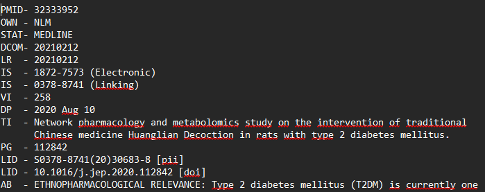
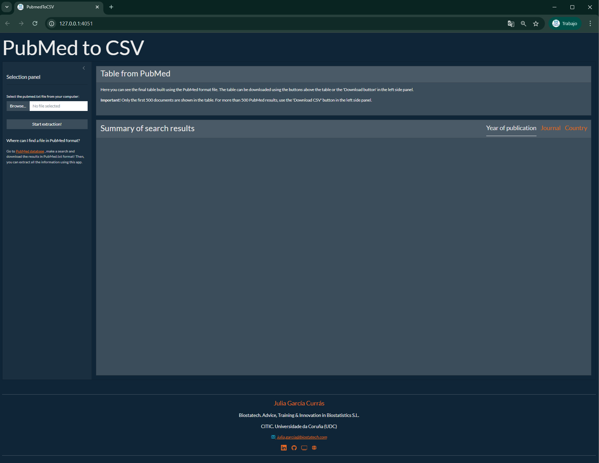
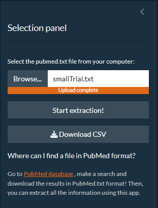
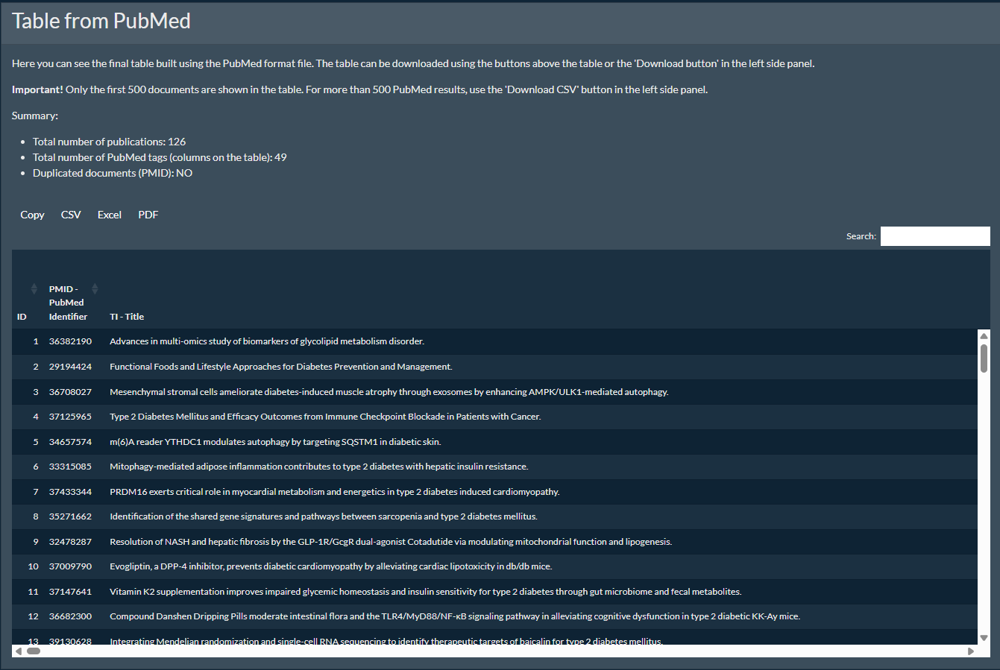
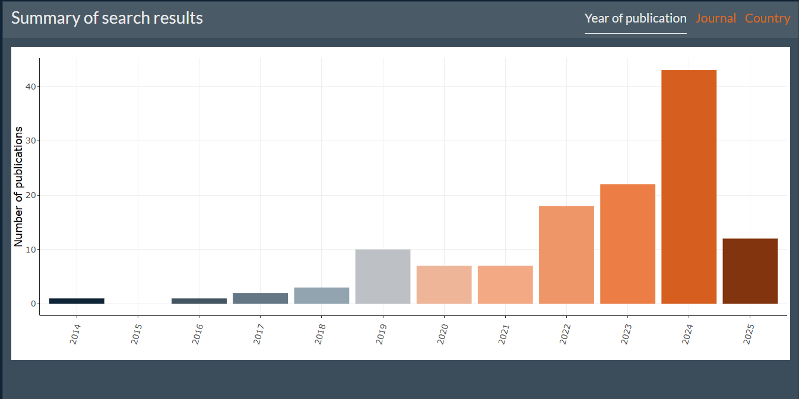
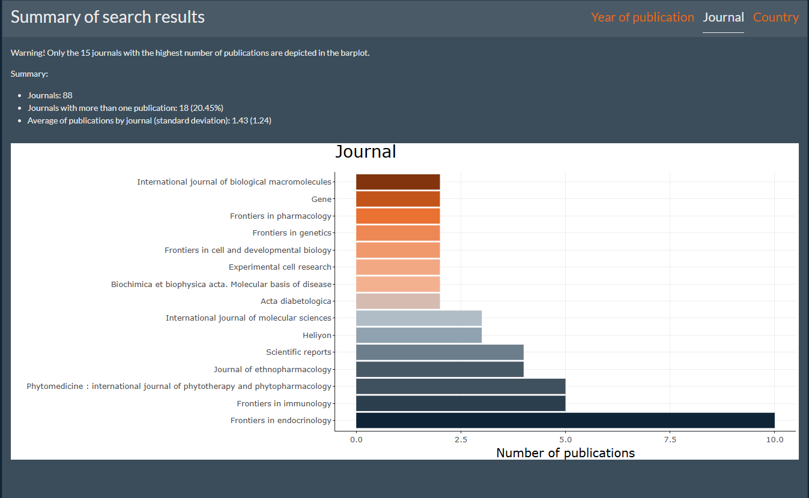
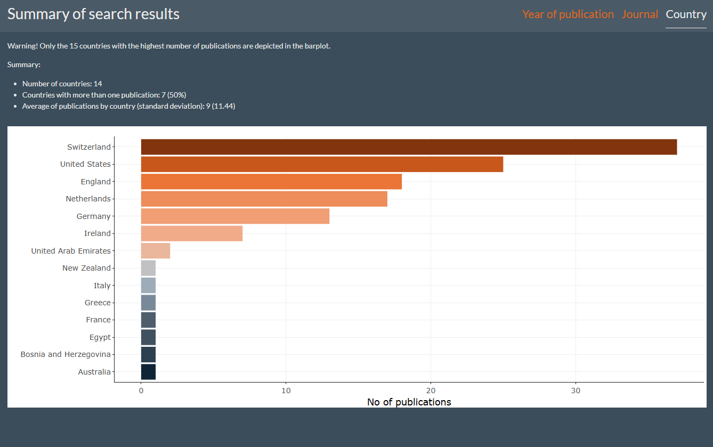

# pubmedToCsv

Shiny app to transform a *PubMed* format *TXT* file file into a *CSV*
file.

## General information

After performing a search in the [PubMed Central (PMC)
database](https://pubmed.ncbi.nlm.nih.gov/) with a specific set of
keywords and optional filters, the results can be downloaded in various
formats. The most complete format is the *PubMed* format, provided as a
plain text file.

This format consists of a block of lines for each article, where each
line begins with a tag of two to four letters that identifies the type
of information it contains. An example can be seen in the following
image:

Since the abstract and all relevant metadata are included in this
format, it is useful to convert it into a tabular structure to filter
and select the most relevant bibliography from the full set of
potentially relevant documents.

This app transforms the *PubMed* format into a table that can be
downloaded in *CSV* format. If the number of documents is fewer than
500, the table can also be downloaded as a *PDF* or *Excel* file. Each
column corresponds to a specific tag, and each row represents an
individual article.

## App usage

### User interface

General overview:

### Selection panel

This user-friendly app consists of a left panel where data can be
uploaded, transformations can be triggered, and the final *CSV* file can
be downloaded using the correspongind button.

### Output panel (I): table of documents

In the **top-right panel**, a preview of the output table is displayed,
showing the first 500 rows. Within this table, users can sort data by
column, search for specific keywords, and using the panel located in the
top left region of the table, information can be also copied or
downloaded in *CSV*, *PDF* or *Excel* format.

### Output panel (II): graphs

Additionally, three summary graphs are shown in the **bottom-right
panel**, displaying publication year, journal, and country information
for the entire set of documents. These graphs can be found in different
overlapping tabs, and to access each of them just click the
corresponding name of the tab.

#### Year of publication

#### Journal

#### Country

These interactive charts can also be downloaded in *PNG* format.

### Contact information

Contac information is provided in the bottom of the web page, with
access to the GitHub repository where any issue can be reported.

## Tags

The most important tags are identified and its meaning is explicitly
mentioned in the column names, but for some tags this information is
missing. In the following table you can see all tha tags consired as
long as their meaning:

<table>

<thead>

<tr>

<th style="text-align:left;">

ID
</th>

<th style="text-align:left;">

Description
</th>

</tr>

</thead>

<tbody>

<tr>

<td style="text-align:left;">

PMID
</td>

<td style="text-align:left;">

PubMed Identifier
</td>

</tr>

<tr>

<td style="text-align:left;">

OWN
</td>

<td style="text-align:left;">

Owner
</td>

</tr>

<tr>

<td style="text-align:left;">

STAT
</td>

<td style="text-align:left;">

Status
</td>

</tr>

<tr>

<td style="text-align:left;">

DCOM
</td>

<td style="text-align:left;">

Date of Communication
</td>

</tr>

<tr>

<td style="text-align:left;">

LR
</td>

<td style="text-align:left;">

Last Revision
</td>

</tr>

<tr>

<td style="text-align:left;">

IS
</td>

<td style="text-align:left;">

ISSN
</td>

</tr>

<tr>

<td style="text-align:left;">

VI
</td>

<td style="text-align:left;">

Volume
</td>

</tr>

<tr>

<td style="text-align:left;">

IP
</td>

<td style="text-align:left;">

Issue
</td>

</tr>

<tr>

<td style="text-align:left;">

DP
</td>

<td style="text-align:left;">

Date of Publication
</td>

</tr>

<tr>

<td style="text-align:left;">

TI
</td>

<td style="text-align:left;">

Title
</td>

</tr>

<tr>

<td style="text-align:left;">

PG
</td>

<td style="text-align:left;">

Pages
</td>

</tr>

<tr>

<td style="text-align:left;">

LID
</td>

<td style="text-align:left;">

Link to DOI
</td>

</tr>

<tr>

<td style="text-align:left;">

AB
</td>

<td style="text-align:left;">

Abstract
</td>

</tr>

<tr>

<td style="text-align:left;">

FAU
</td>

<td style="text-align:left;">

Full Author
</td>

</tr>

<tr>

<td style="text-align:left;">

AU
</td>

<td style="text-align:left;">

Author
</td>

</tr>

<tr>

<td style="text-align:left;">

AD
</td>

<td style="text-align:left;">

Affiliation
</td>

</tr>

<tr>

<td style="text-align:left;">

LA
</td>

<td style="text-align:left;">

Language
</td>

</tr>

<tr>

<td style="text-align:left;">

GR
</td>

<td style="text-align:left;">

Grants
</td>

</tr>

<tr>

<td style="text-align:left;">

PT
</td>

<td style="text-align:left;">

Publication Type
</td>

</tr>

<tr>

<td style="text-align:left;">

DEP
</td>

<td style="text-align:left;">

Date of Electronic Publication
</td>

</tr>

<tr>

<td style="text-align:left;">

PL
</td>

<td style="text-align:left;">

Country of publication
</td>

</tr>

<tr>

<td style="text-align:left;">

TA
</td>

<td style="text-align:left;">

Title Abbreviation
</td>

</tr>

<tr>

<td style="text-align:left;">

JT
</td>

<td style="text-align:left;">

Journal Title
</td>

</tr>

<tr>

<td style="text-align:left;">

JID
</td>

<td style="text-align:left;">

Journal ID
</td>

</tr>

<tr>

<td style="text-align:left;">

RN
</td>

<td style="text-align:left;">

Registry Number
</td>

</tr>

<tr>

<td style="text-align:left;">

SB
</td>

<td style="text-align:left;">

Subheading
</td>

</tr>

<tr>

<td style="text-align:left;">

MH
</td>

<td style="text-align:left;">

MeSH Terms
</td>

</tr>

<tr>

<td style="text-align:left;">

PMC
</td>

<td style="text-align:left;">

PubMed Central Identifier
</td>

</tr>

<tr>

<td style="text-align:left;">

MID
</td>

<td style="text-align:left;">

Manuscript Identifier
</td>

</tr>

<tr>

<td style="text-align:left;">

OTO
</td>

<td style="text-align:left;">

Other
</td>

</tr>

<tr>

<td style="text-align:left;">

OT
</td>

<td style="text-align:left;">

Other Terms
</td>

</tr>

<tr>

<td style="text-align:left;">

COIS
</td>

<td style="text-align:left;">

Conflicts of Interest
</td>

</tr>

<tr>

<td style="text-align:left;">

Si:
</td>

<td style="text-align:left;">

Date of Entry
</td>

</tr>

<tr>

<td style="text-align:left;">

MHDA
</td>

<td style="text-align:left;">

Medline Date of Entry
</td>

</tr>

<tr>

<td style="text-align:left;">

PMCR
</td>

<td style="text-align:left;">

PubMed Central Release Date
</td>

</tr>

<tr>

<td style="text-align:left;">

CRDT
</td>

<td style="text-align:left;">

Date Created
</td>

</tr>

<tr>

<td style="text-align:left;">

PHST
</td>

<td style="text-align:left;">

Public Health Service Dates
</td>

</tr>

<tr>

<td style="text-align:left;">

AID
</td>

<td style="text-align:left;">

Article Identifier
</td>

</tr>

<tr>

<td style="text-align:left;">

PST
</td>

<td style="text-align:left;">

Publication Status
</td>

</tr>

<tr>

<td style="text-align:left;">

SO
</td>

<td style="text-align:left;">

Source
</td>

</tr>

<tr>

<td style="text-align:left;">

DB
</td>

<td style="text-align:left;">

Database
</td>

</tr>

<tr>

<td style="text-align:left;">

DA
</td>

<td style="text-align:left;">

Date Added
</td>

</tr>

<tr>

<td style="text-align:left;">

CN
</td>

<td style="text-align:left;">

Corresponding Author
</td>

</tr>

<tr>

<td style="text-align:left;">

EI
</td>

<td style="text-align:left;">

Electronic Identifier
</td>

</tr>

<tr>

<td style="text-align:left;">

MA
</td>

<td style="text-align:left;">

Manuscript
</td>

</tr>

<tr>

<td style="text-align:left;">

DT
</td>

<td style="text-align:left;">

Document Type
</td>

</tr>

<tr>

<td style="text-align:left;">

VN
</td>

<td style="text-align:left;">

Volume Number
</td>

</tr>

<tr>

<td style="text-align:left;">

AL
</td>

<td style="text-align:left;">

Abstract Language
</td>

</tr>

<tr>

<td style="text-align:left;">

CD
</td>

<td style="text-align:left;">

Case Description
</td>

</tr>

<tr>

<td style="text-align:left;">

CA
</td>

<td style="text-align:left;">

Chemical Abstract
</td>

</tr>

<tr>

<td style="text-align:left;">

CI
</td>

<td style="text-align:left;">

Citation
</td>

</tr>

<tr>

<td style="text-align:left;">

V
</td>

<td style="text-align:left;">

Version
</td>

</tr>

<tr>

<td style="text-align:left;">

BD
</td>

<td style="text-align:left;">

Biological Data
</td>

</tr>

<tr>

<td style="text-align:left;">

IC
</td>

<td style="text-align:left;">

Inclusion Criteria
</td>

</tr>

<tr>

<td style="text-align:left;">

RL
</td>

<td style="text-align:left;">

References List
</td>

</tr>

<tr>

<td style="text-align:left;">

PB
</td>

<td style="text-align:left;">

Publisher
</td>

</tr>

<tr>

<td style="text-align:left;">

SD
</td>

<td style="text-align:left;">

Source Document
</td>

</tr>

<tr>

<td style="text-align:left;">

LI
</td>

<td style="text-align:left;">

Literature
</td>

</tr>

<tr>

<td style="text-align:left;">

RS
</td>

<td style="text-align:left;">

Research Support
</td>

</tr>

<tr>

<td style="text-align:left;">

LM
</td>

<td style="text-align:left;">

Link Management
</td>

</tr>

<tr>

<td style="text-align:left;">

LMID
</td>

<td style="text-align:left;">

Link Management ID
</td>

</tr>

<tr>

<td style="text-align:left;">

DID
</td>

<td style="text-align:left;">

Document Identifier
</td>

</tr>

<tr>

<td style="text-align:left;">

LC
</td>

<td style="text-align:left;">

Literature Citation
</td>

</tr>

<tr>

<td style="text-align:left;">

MI
</td>

<td style="text-align:left;">

Manuscript Identifier
</td>

</tr>

<tr>

<td style="text-align:left;">

UC
</td>

<td style="text-align:left;">

Update Citation
</td>

</tr>

<tr>

<td style="text-align:left;">

SI
</td>

<td style="text-align:left;">

Study Identifier
</td>

</tr>

<tr>

<td style="text-align:left;">

CID
</td>

<td style="text-align:left;">

Case ID
</td>

</tr>

<tr>

<td style="text-align:left;">

EDAT
</td>

<td style="text-align:left;">

Entry Date
</td>

</tr>

<tr>

<td style="text-align:left;">

DOI
</td>

<td style="text-align:left;">

Digital Object Identifier
</td>

</tr>

<tr>

<td style="text-align:left;">

ET
</td>

<td style="text-align:left;">

Entry Term
</td>

</tr>

<tr>

<td style="text-align:left;">

PUB
</td>

<td style="text-align:left;">

Publication Type
</td>

</tr>

<tr>

<td style="text-align:left;">

NLM
</td>

<td style="text-align:left;">

National Library of Medicine
</td>

</tr>

<tr>

<td style="text-align:left;">

DO
</td>

<td style="text-align:left;">

Date of Publication
</td>

</tr>

<tr>

<td style="text-align:left;">

MT
</td>

<td style="text-align:left;">

MeSH Term
</td>

</tr>

<tr>

<td style="text-align:left;">

CR
</td>

<td style="text-align:left;">

Cited Reference
</td>

</tr>

<tr>

<td style="text-align:left;">

RT
</td>

<td style="text-align:left;">

Reference Type
</td>

</tr>

<tr>

<td style="text-align:left;">

AF
</td>

<td style="text-align:left;">

Author Full Name
</td>

</tr>

<tr>

<td style="text-align:left;">

GCP
</td>

<td style="text-align:left;">

Good Clinical Practice
</td>

</tr>

<tr>

<td style="text-align:left;">

CT
</td>

<td style="text-align:left;">

Clinical Trial
</td>

</tr>

<tr>

<td style="text-align:left;">

OP
</td>

<td style="text-align:left;">

Original Article
</td>

</tr>

<tr>

<td style="text-align:left;">

CU
</td>

<td style="text-align:left;">

Country of Study
</td>

</tr>

<tr>

<td style="text-align:left;">

FD
</td>

<td style="text-align:left;">

Final Date
</td>

</tr>

<tr>

<td style="text-align:left;">

PM
</td>

<td style="text-align:left;">

PubMed ID
</td>

</tr>

<tr>

<td style="text-align:left;">

SA
</td>

<td style="text-align:left;">

Substance Author
</td>

</tr>

<tr>

<td style="text-align:left;">

MD
</td>

<td style="text-align:left;">

MeSH Descriptor
</td>

</tr>

<tr>

<td style="text-align:left;">

BC
</td>

<td style="text-align:left;">

Bibliographic Citation
</td>

</tr>

<tr>

<td style="text-align:left;">

PPI
</td>

<td style="text-align:left;">

Publisher’s Page Identifier
</td>

</tr>

<tr>

<td style="text-align:left;">

PII
</td>

<td style="text-align:left;">

Publisher Item Identifier
</td>

</tr>

</tbody>

</table>

